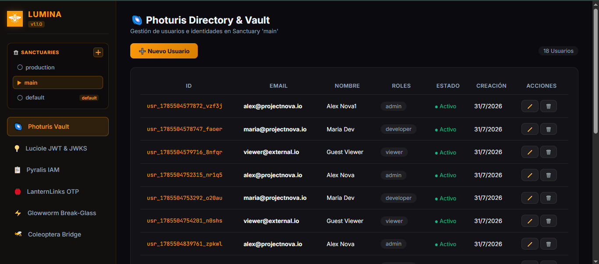

<p align="center">
  
</p>

<h1 align="center">🔐 LUMINA — Terra Ecosystem Identity &amp; Auth Engine</h1>

<p align="center">
  <strong>Infraestructura de Autenticación Serverless, Sanctuaries (Entornos Aislados), Políticas IAM Granulares Estilo AWS, Magic Links y Broker Multicloud a Coste $0</strong>
</p>

<p align="center">
  <a href="#-visión-y-filosofía">Visión</a> •
  <a href="#-demostración-visual-y-consola-web">Consola Web</a> •
  <a href="#-sanctuaries-aislamiento-multi-entorno">Sanctuaries</a> •
  <a href="#-nomenclatura-y-módulos-bioluminosos">Módulos</a> •
  <a href="#-instalación-y-configuración">Instalación</a> •
  <a href="#-ejemplos-prácticos-del-sdk">Ejemplos SDK</a> •
  <a href="#-referencia-completa-de-la-cli">CLI Reference</a> •
  <a href="#-licencia">Licencia</a>
</p>

---

## 🌐 Visión y Filosofía

**LUMINA** es el motor central de identidad (IdP), control de acceso por roles (RBAC) y políticas granulares (ABAC estilo AWS IAM) del **Ecosistema Terra**. Ha sido concebido para eliminar por completo los costes recurrentes de plataformas como Auth0, Okta, Clerk o Supabase Auth.

Toda la base de identidades, políticas y sesiones se almacena de forma estructurada en tu propio repositorio privado **`.lumina-storage`** en GitHub, permitiendo una infraestructura de seguridad enterprise sin servidores y a coste cero.

---

## 🖼️ Demostración Visual y Consola Web

Accede a la consola web oficial en vivo 24/7:  
👉 **[https://amglogicalis.github.io/lumina-repo-public/](https://amglogicalis.github.io/lumina-repo-public/)**

<p align="center">
  
</p>

---

## 🏛️ Sanctuaries — Aislamiento Multi-Entorno

**LUMINA** introduce el concepto de **Sanctuaries** (Santuarios), permitiendo aislar completamente usuarios, roles y políticas entre diferentes aplicaciones o entornos (por ejemplo `production`, `staging`, `app-billing`, `internal-tools`).

- **Sanctuary `default`**: Creado automáticamente en la primera sesión para retrocompatibilidad instantánea.
- **Aislamiento Total**: Los usuarios creados en un Sanctuary no existen en otros Santuarios.
- **Gestión Completa**: Creación, cambio de contexto, renombrado y eliminación (con modales de confirmación con diseño *dark glassmorphic*).

---

## 🪲 Nomenclatura y Módulos Bioluminosos

| Módulo | Concepto Tradicional | Descripción |
| :--- | :--- | :--- |
| **🏛️ Sanctuaries** | Multi-Tenancy / Environments | Aislamiento de identidades y políticas entre entornos (`production`, `staging`, etc.). |
| **🌌 Photuris Vault** | User Directory & Database | Directorio inmutable de usuarios en `.lumina-storage` con soporte de múltiples roles (`roles: string[]`). |
| **💡 Luciole Engine** | JWT & JWKS Signer | Motor criptográfico de firma HMAC-SHA256 y endpoint JWKS abierto para verificación offline sin latencia. |
| **📋 Pyralis IAM** | AWS IAM Policy Evaluator | Evaluador `Allow`/`Deny` con soporte de wildcards (`*`) sobre recursos `arn:terra:...` o nubes externas. |
| **🏮 LanternLinks** | Magic Links & OTP | Generación de enlaces mágicos sin contraseña con tokens únicos y protección anti-replay. |
| **⚡ Glowworm** | Break-Glass Emergency Access | Emisión de credenciales super-admin temporales de 15 minutos con audit log automático. |
| **🐝 Coleoptera Bridge** | Multicloud Identity Exporter | Broker de exportación hacia Auth0, Supabase Auth, AWS IAM y Firebase Auth. |

---

## 📦 Instalación y Configuración

### 1. Instalación Global del Paquete `terra-lumina`
```bash
npm install -g terra-lumina
```

### 2. Inicialización en tu Proyecto
```bash
cd mi-proyecto
npx lumina init
```
Esto creará el archivo `lumina.config.json`:
```json
{
  "storageRepo": ".lumina-storage",
  "branch": "main",
  "issuer": "lumina.terra",
  "sanct": "default"
}
```

### 3. Abrir Consola Web Local (Offline en Localhost)
```bash
npx lumina studio
# o equivalente con puerto personalizado:
npx lumina console --port 4000
```
*Inicia un servidor HTTP local en `http://localhost:3720` (o puerto personalizado) para administrar el IdP de forma 100% privada e hiperrápida sin depender de Internet. Si el puerto está ocupado, detecta automáticamente el siguiente disponible.*

---

## 🛠️ Ejemplos Prácticos del SDK

### 1. Inicialización y Selección de Sanctuary
```typescript
import { Lumina } from 'terra-lumina';

const lumina = new Lumina({
  githubToken: process.env.GITHUB_TOKEN!,
  storageRepo: '.lumina-storage',
  sanct: 'production' // Conecta directamente al Sanct 'production'
});

await lumina.init();
```

### 2. Crear y Gestionar Usuarios Multi-Rol (Photuris Vault)
```typescript
// Crear usuario con roles múltiples
const user = await lumina.createUser(
  'maria@empresa.com',
  'María García',
  ['admin', 'developer']
);

// Editar parámetros de usuario existente
await lumina.updateUser(user.id, {
  name: 'María García-López',
  roles: ['admin', 'lead-developer']
});
```

### 3. Crear Políticas IAM Granulares y Evaluar Accesos (Pyralis IAM)
```typescript
// Crear una política estilo AWS IAM
const policy = await lumina.createPolicy(
  'combase-db-admin',
  [
    {
      Effect: 'Allow',
      Action: ['combase:read', 'combase:write', 'combase:query'],
      Resource: 'arn:terra:combase:database_prod/*'
    },
    {
      Effect: 'Deny',
      Action: ['combase:dropDatabase'],
      Resource: '*'
    }
  ],
  'Permisos de administración de Combase DB'
);

// Evaluar permisos para un conjunto de roles
const evalResult = await lumina.evaluateForRoles(
  'combase:query',
  'arn:terra:combase:database_prod/table_users',
  ['admin']
);

console.log(evalResult.allowed ? '✅ ACCESO PERMITIDO' : '❌ DENIED');
```

### 4. Generar y Verificar Tokens Criptográficos (Luciole JWT)
```typescript
// Generar JWT con expiración de 1 hora
const token = lumina.signToken({
  sub: user.id,
  email: user.email,
  roles: user.roles
}, 3600);

// Verificar token
const verification = lumina.verifyToken(token);
if (verification.valid) {
  console.log('Token válido para el usuario:', verification.payload.sub);
}
```

### 5. Crear Magic Links OTP sin Contraseña (LanternLinks)
```typescript
const magic = lumina.createMagicLink('maria@empresa.com', 300); // 5 minutos de validez
console.log('Enlace Mágico:', magic.url);
```

---

## 🖥️ Referencia Completa de la CLI

| Comando | Descripción |
| :--- | :--- |
| `lumina init` | Inicializa `lumina.config.json` en el directorio actual. |
| `lumina studio` | Abre la consola web local en el navegador. |
| `lumina sanct ls` | Lista todos los Sanctuaries y su número de usuarios. |
| `lumina sanct create <nombre> [desc]` | Crea un nuevo Sanctuary aislado. |
| `lumina sanct use <nombre>` | Cambia el Sanctuary activo para la CLI. |
| `lumina sanct rename <viejo> <nuevo>` | Renombra un Sanctuary manteniendo sus identidades. |
| `lumina sanct rm <nombre>` | Elimina un Sanctuary (salvo `default`). |
| `lumina photuris ls` | Lista los usuarios del Sanctuary activo. |
| `lumina photuris create <email> <nombre> [roles]` | Crea un usuario en el Sanctuary activo. |
| `lumina photuris rm <user_id>` | Elimina un usuario por su ID. |
| `lumina pyralis policy ls` | Lista las políticas IAM del Sanctuary activo. |
| `lumina pyralis eval <action> <resource> [roles]` | Evalúa permisos estilo AWS IAM sobre un recurso. |
| `lumina luciole sign <user_id> [roles]` | Genera y firma un JWT de acceso. |
| `lumina luciole jwks` | Muestra la clave pública JWKS en formato JSON. |
| `lumina lantern <email> [ttl]` | Genera un Magic Link sin contraseña. |
| `lumina glowworm <user_id> <motivo>` | Emite credencial de emergencia de 15 minutos (Break-Glass). |
| `lumina coleoptera export <provider>` | Exporta datos a Auth0, Supabase, AWS IAM o Firebase. |

---

## 📄 Licencia

Este proyecto se distribuye bajo la Licencia **MIT** — Libre para uso personal y comercial en cualquier entorno.
